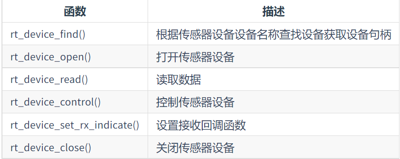

# summerknowlegde

# 作品名称：智能温湿度监测系统

## 作品背景

随着经济社会加快向数字化智能化转型升级，在生产生活各个领域，物联网正展现出显著的行业赋能作用。由于物联网可以通过信息采集与获取，实现可靠连接和智能感知，进而对数据进行传输处理和应用，可以说是信息基础设施的‘底座’。温湿度是我们日常生产生活中较为关心的两个数据，通过智能温湿度检测设备，我们能够实时在云端记录当前环境温湿度值，快捷方便且高效。

## 实现功能

可以实时在OLED 屏幕上显示出当前环境的温湿度，并可将相应数据上传至云平台,若是数据错误，则显示Warning!!!！

## RT-Thread使用情况


## 软件包

 

1. AHT10:用于温湿度检测模块。
2. U8G2：用于显示温湿度数值。
3. AT_device:用于ESP8266-01S进行连接WIFI。
4. Onenet：用于温湿度数据传输上云平台。
5. WebClient:用于获取http报文内容。
6. cJSON：使用C语言编写的JSON数据解析器。

## 硬件框架图


## 硬件引脚连接如下所示

 
 

 **[注意]**

因为AHT10和SSD1306我们使用的是软件模拟I2C，所以在连接电路的时候需要注意不能连接硬件I2C的引脚。
在使用这个ESP8266时候，我们用到USB转TTL串口对固件进行更新。并且在接线的时候RX和TX都是相互连接的。

## 软件框架


## 主函数部分


```C

int main(void)
{
    _sensor_mtx = rt_mutex_create("sensor", RT_IPC_FLAG_PRIO);
    if (_sensor_mtx == RT_NULL)
    {
        LOG_E("create sensor mtx failed.");
        return -RT_ERROR;
    }

    _tick_timeout = rt_tick_get() + rt_tick_from_millisecond(5000);

    rt_thread_t temp_humi_thread = rt_thread_create("temp_humi", temp_humi_thread_entry, RT_NULL, 2048, 1, 10);
    if (temp_humi_thread != RT_NULL)
        rt_thread_startup(temp_humi_thread);
    rt_thread_t oled_thread = rt_thread_create("oled", oled_thread_entry, RT_NULL, 2048, 5, 10);
    if (oled_thread != RT_NULL)
        rt_thread_startup(oled_thread);
    rt_thread_t onenet_thread = rt_thread_create("onenet", onenet_thread_entry, RT_NULL, 2048, 7, 10);
    if (onenet_thread != RT_NULL)
        rt_thread_startup(onenet_thread);
    return 0;
}


```

## AHT10硬件初始化

```C

int rt_hw_aht10_port(void)
{
    struct rt_sensor_config cfg;
    cfg.intf.dev_name = AHT10_I2C_BUS;
    cfg.intf.user_data = (void *) AHT10_I2C_ADDR;
    rt_hw_aht10_init("aht10", &cfg);
    return RT_EOK;
}
INIT_ENV_EXPORT(rt_hw_aht10_port);

```

## SENSOR框架设备




## 温湿度线程的入口函数

```C

 void temp_humi_thread_entry(void *arg)
{
    _humi_dev = rt_device_find(HUMI_DEVICE_NAME); //通过查找获取句柄
    if (_humi_dev == RT_NULL)
    { //如果差找不到，我们输出如下
        rt_kprintf("find %s device failed.\r\n", HUMI_DEVICE_NAME);
        return;
    }
    else
    { //如果查找成功，我们打开传感器
        rt_device_open(_humi_dev, RT_DEVICE_FLAG_RDONLY);
    } //这部分不能写在while循环中，因为查找和打开只需要操作一次就可以

    _temp_dev = rt_device_find(TEMP_DEVICE_NAME);
    if (_temp_dev == RT_NULL)
    {
        rt_kprintf("find %s device failed.\r\n", TEMP_DEVICE_NAME);
        return;
    }
    else
    {
        rt_device_open(_temp_dev, RT_DEVICE_FLAG_RDONLY);
    }
    struct rt_sensor_data data1;
    struct rt_sensor_data data2;
    while (1)
    {
        if ((rt_device_read(_temp_dev, 0, &data1, 1) == 1) && (rt_device_read(_humi_dev, 0, &data2, 1) == 1))
        {
            // printf("temp:%3d.%d C humi:%3d.%d%%\r\n", data1.data.temp / 10, (rt_uint32_t)data1.data.temp % 10,
            //        data2.data.temp / 10, data2.data.humi % 10);

            _tick_timeout = rt_tick_get() + rt_tick_from_millisecond(2000);
            rt_mutex_take(_sensor_mtx, RT_WAITING_FOREVER);
            aht10_temp = data1.data.temp; //将温度值直接赋值给全局变量
            aht10_humi = data2.data.humi;
            rt_mutex_release(_sensor_mtx);
        }
        rt_thread_mdelay(5);
    }
}

```

  **[注意]**

在这里，我们使用的是在函数外声明的全局变量，把temp和humi数据值赋值给全局变量。

rt_int32_t aht10_temp;
rt_int32_t aht10_humi;

## OLED显示线程的入口函数

```C

void oled_thread_entry(void *arg)
{

    u8g2_t u8g2;
    // Initialization
    u8g2_Setup_ssd1306_i2c_128x64_noname_f(&u8g2, U8G2_R0, u8x8_byte_sw_i2c, u8x8_gpio_and_delay_rtthread);
    u8x8_SetPin(u8g2_GetU8x8(&u8g2), U8X8_PIN_I2C_CLOCK, OLED_I2C_PIN_SCL);
    u8x8_SetPin(u8g2_GetU8x8(&u8g2), U8X8_PIN_I2C_DATA, OLED_I2C_PIN_SDA);

    u8g2_InitDisplay(&u8g2);
    u8g2_SetPowerSave(&u8g2, 0);

    while (1)
    {
        u8g2_ClearBuffer(&u8g2);
        u8g2_SetFont(&u8g2, u8g2_font_ncenB08_tr);
        u8g2_DrawStr(&u8g2, 35, 18, "Temputer");
        u8g2_DrawStr(&u8g2, 35, 38, "Humidity");
        if (rt_tick_get() - _tick_timeout < (RT_TICK_MAX / 2))
        {
            u8g2_DrawStr(&u8g2, 50, 28, "Warning!!!!");
            u8g2_DrawStr(&u8g2, 50, 48, "Warning!!!!");
        }
        else
        {
            rt_mutex_take(_sensor_mtx, RT_WAITING_FOREVER);
            sprintf(a, "%d.%d      ", aht10_temp / 10, aht10_temp % 10);
            sprintf(b, "%d.%d      ", aht10_humi / 10, aht10_humi % 10);
            rt_mutex_release(_sensor_mtx);

            LOG_I("a:%s", a); LOG_I("b:%s", b);

            u8g2_DrawStr(&u8g2, 50, 28, a);
            u8g2_DrawStr(&u8g2, 50, 48, b);
        }
        u8g2_SendBuffer(&u8g2);

        rt_thread_mdelay(100);
    }
}

   ```

 **[注意]**

1.在这部分中定义了两个字符串用于存储OLED显示模块通过sprintf转出来的字符串
char a[20]="";
char b[20]="";
2.线程while循环里要放实现线程功能的全部代码；外头只放只需要运行一次的初始化和局部变量声明；
3.线程里的结构就和裸机开发时候main函数是一样的；线程切换的时候就和裸机主函数被中断是一样的；
在哪里被中断回来时还是从哪里开始运行；切换回来不会从线程入口函数一开始运行；
所以说我们的sprintf要放进while(1)循环里。

## Onenet 云平台

```C

void onenet_thread_entry(void *arg)
{
    rt_thread_mdelay(10000);
    double temp_d, humi_d;
    onenet_mqtt_init();

    while (1)
    {
        rt_mutex_take(_sensor_mtx, RT_WAITING_FOREVER);
        temp_d = (double) aht10_temp / 10;
        humi_d = (double) aht10_humi / 10;
        rt_mutex_release(_sensor_mtx);

        rt_thread_delay(rt_tick_from_millisecond(5 * 1000));
        onenet_mqtt_upload_digit("strtemp", temp_d);
        rt_thread_delay(rt_tick_from_millisecond(5 * 1000));
        onenet_mqtt_upload_digit("strhumi", humi_d);
        rt_thread_delay(rt_tick_from_millisecond(5 * 1000));
    }
}

 ```
 
 ## 互斥锁的使用

 

 在main函数中创建一个互斥锁

 ```C

 _sensor_mtx = rt_mutex_create("sensor", RT_IPC_FLAG_PRIO);
    if (_sensor_mtx == RT_NULL)
    {
        LOG_E("create sensor mtx failed.");
        return -RT_ERROR;
    }

```
进行互斥锁的获取

```C

 rt_mutex_take(_sensor_mtx, RT_WAITING_FOREVER);

 ```
互斥锁的释放

```C

 rt_mutex_release(_sensor_mtx);

 ```
在这个线程入口函数中，我们进行了aht10_temp类型的强转，可以使得我们在云平台上传成功小数数据。

## 项目结果

整体连接如下
 
 正常状态下显示温湿度数据

 

数据错误时候显示如下

 

#项目视频

